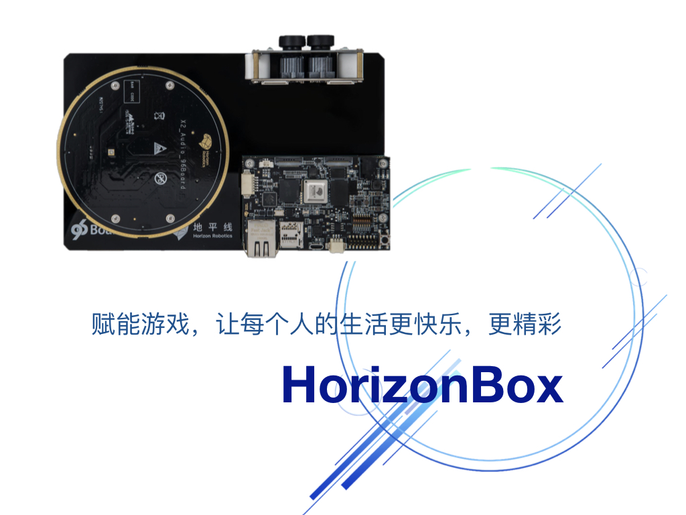
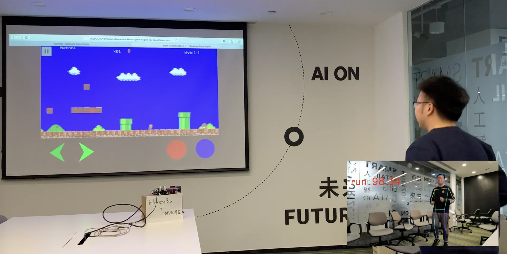
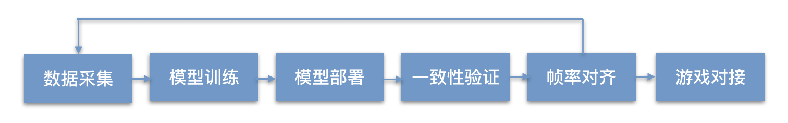
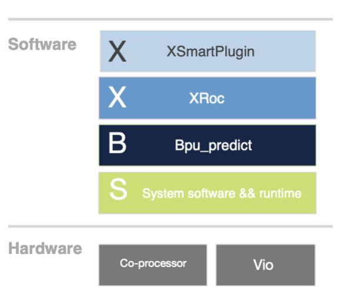

# HorizonBox -- 60亿人都在玩的游戏机

## 一、项目介绍
    
我们的项目是结合视觉算法（人体检测，行为识别等），作出一款Horizon Box（简易版体感）游戏机。

### 1. 愿景
赋能游戏，让每个人的生活更快乐，更精彩。

### 2. 介绍
游戏，一直是人们基于现有技术，对未来技术，以及对未来生活的想象。这其中，现有技术便是所有想象的支点。所以，游戏一直在随着技术的变革产生着变化。除了技术的变革以外，游戏也承载了和人越来越有关的内容，比如勇气，乐观，爱情等等。从世界上第一款用示波器做的电子游戏 "Tennis for two" 开始，人们对游戏的制作一直是希望拟人化，以及和现实生活有关的，比如1986年诞生的街头争霸，1996年诞生的古墓丽影是冒险的象征，1997年诞生的仙剑奇侠传凄美的爱情令人感动。往后画面越来越清晰，越来越逼真。
所以可以看到，游戏虽然是虚拟的，但是却一直在向着真实去发展。因此，为了让大家低成本体验真实的游戏感受，我们尝试使用地平线的96board+行为识别算法+辅助人体关键点检测算法做出了一款体感游戏机，我们称它为Horizon Box。

Horizon Box支持跑，跳，攻击等动作，可以使用这些动作和游戏进行有效结合，增加真实游戏的体验，让你如临其境。

### 3. 商业价值

#### 底层娱乐
我们的方案可以和游戏厂商以及游戏主机厂商对接。
#### 中层赋能
同时我们开放出AI技术接口，开放软件接口，为开发者赋能。
#### 上层生态
基于端行为识别也可以作为交互的入口，比如智慧屏，云游戏+端交互等等。

## 二、解决方案介绍

本方案采用基于序列的行为识别模型与人体关键点检测相结合进行行为识别从而与游戏端产生交互，本方案流程框图如下：

从上图中可看出，HorizonBox的诞生历经从采集数据开始：

### 1. 采集数据
采集与游戏交互会使用的“跳”、“跑”、“攻击”、“站立”等动作，将采集到的视频数据抽帧成图片，人工将图片标记为相应的动作。
接着是模型训练。

### 2. 模型训练
炼金术，此处省略三万字。
要提到的步骤是要将模型Op适配，X2对大部分Op都可以无缝支持，但不排除有个别需要特殊处理，这也不得不提到地平线天工开物工具链，同时，采用工具链中的定点化工具将模型参数定点化，到此，模型便可以扔到板子上等待起舞了。

### 3. 模型部署

因为本方案中用到了人体框检测(Fasterrcnn)、行为特征提取、时序融合三个模型，将多个模型部署在CP端需基于地平线提供的Xroc开发框架，该框架的作用是提供模型串接的接口，进行模型运行调度等。在本方案模型部署阶段通过调用Xroc API将模型进行一些简单处理后送入BPU(Brain Processing Unit， X2深度学习加速器)进行模型运算加速，单个模型运行结束后进行后处理再次送入BPU运行下一个模型。由于X2是双核异构，帧与帧之间模型运行调度就是XRoc要解决的问题。下图所示是地平线工具链的架构图（简图），详细工具介绍及API请参考官方文档：     

### 4. 一致性验证

如果不出意外CP端模型运行结果是与GPU预测(mxnet or TensorFlow)结果是一致的，但是意外无处不在，大概率是出在模型部署阶段的前后处理，在此也不要为debug感到无助，我们采用天工开物工具链提供的model_verifier工具定位，并且采用runtime接口将BPU黑盒打开，一步步一个一个模型进行比对将一致性对上。   
一致性通过后，模型的问题就该告一段落了，但开发并没有结束。

### 5. 帧率对齐

游戏对于时序和延迟要求较高，如果模型计算力大到超出了BPU负载，那帧率便会影响到精确度，精确度低到怀疑自己，所以提高模型性能、降低采集数据的帧率两端就像跷跷板的两端一样互相倾斜，达到平衡适配。注：本方案由于时间有限只能在此平衡处理，如果时间充裕，可调优模型或者优化开发来提高帧率，降低延迟。   
本方案到此，可识别出人体行为动作，包括“跑”、“跳”、“攻击”、“站立”这些常用的游戏交互动作，并且精确度较高。

### 6. 游戏对接

通过websocket, 将识别出的动作传输到等待接收指令的游戏端。   
整个开发解决方案就至此结束了。

## 三、开发教程
在此将我们开发部署的可执行文件上传，在CP端运行可执行代码，模型便开始根据摄像头不断流入的视频帧进行动作识别，并且启动websocket服务，将每视频帧检测到的结果发送到websocket客户端.     
在此我们也上传了几款游戏，这几款游戏已经做好了适配，直接打开，可监听到CP端发送到行为检测信号，并驱动游戏。
### 开发环境、所需硬件、软件等
开发环境即为2019 hackthon提供的96 board和X2开发板，同时需要一台可联网的PC。
以上方案的所有开发代码将以可执行文件提供，除此之外，无需其他软硬件。
### 软件库 & 代码、下载与安装
相关程序见本Repo

### 过程讲解

CP端: 
    1）将git库中的xppcp_smart_sample文件夹拷贝到96board任意目录，一般建议放在/userdata/目录下 
    2）运行xppcp_smart_sample目录下的xpp_start.sh即可启动CP端服务

PC：
我们目前开发了两款游戏，位于web_frontend中

CrappyBird: 
    1）修改ip地址及端口号（需要和CP对应）CrappyBird-master/index.html 272行 
    2）在启动CP端以后, 用浏览器打开CrappyBird-master/index.html

Panda_Run： 
    1）修改ip地址及端口号（需要和CP对应）Panda_Run/c2runtime.js 18652行 
    2）在启动CP端以后，cd Panda_Run; python -m http.server 8080; 在浏览器打开对应ip链接

## 四、经验分享

见解决方案
